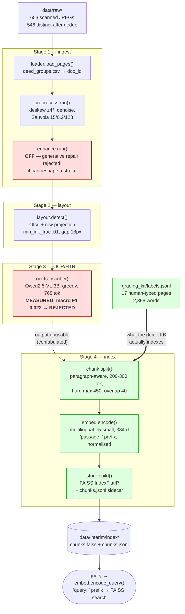

# Knowledge-base pipeline (A2)

The fixed stage order lives in `src/doc_agent/pipeline.py:build_knowledge_base()` and may not be
reordered. Everything below is what actually runs today, including the stage that is measured and
rejected — this is a build report, not a plan.



## Contracts on each edge

The types are frozen in `src/doc_agent/contracts.py`; a stage may only change what flows *inside*
them.

| Edge | Type | Note |
|---|---|---|
| loader → preprocess → enhance | `list[Page]` | `id`, `image_path`, `doc_id` |
| layout → OCR | `list[Region]` | `page_id`, `bbox`, `kind` — always `"text"` today |
| OCR → chunk | `list[Chunk]` | **one Chunk per PAGE**, not per region, so the chunker can still cut on deed/paragraph boundaries that span regions |
| chunk → embed → store | `list[Chunk]` + `ndarray` | 384-d, L2-normalised, so inner product = cosine |
| retrieval → agent | `list[Chunk]` with `.score` | Stage 5, not built yet |

## Cross-cutting seams

Horizontal features attach at fixed hook points (`hooks.py`, wired in `wiring.py`) rather than
being inlined into stage code:

```
after_ingest ──► (fairness metadata)
after_ocr    ──► governance/pii.redact      ← PII must not reach the index
before_index ──► logging/trace
```

## Status, honestly

| Stage | State |
|---|---|
| 1 Ingest | implemented; enhancement deliberately OFF |
| 2 Layout | implemented, 12 tests. Region = page on camera-photo scans, which is expected, not a failure |
| **3 OCR** | implemented and **measured at macro F1 0.022 against a 0.92 target** — the reader confabulates Bangla prose rather than reading handwriting, on both a 3B and a 9B model. It *does* read printed text correctly. GraDeT-HTR is the promoted candidate; weights are request-only |
| 4 Index | implemented; no dedicated test file yet |
| 5 Retrieval | `Retriever.retrieve()` still raises — A3 |

**Why the diagram has a dotted line into chunking.** Stage 3's output is not fit to index: filling
the store with invented text is worse than an empty store, because retrieval would then return
confident citations to sentences no deed contains. So the demo knowledge base is built from the 17
human-transcribed gold pages (~3.1% of the corpus) — real Bangla legal text, honestly reported as a
subset. `chunk`/`embed`/`store` operate on whatever text a `Chunk` carries, so the identical code
indexes the full corpus the moment Stage 3 has a working reader.

Full decision records: `src/doc_agent/vision/ocr.py` (D2 MEASURED), `configs/design_choices.md`.
